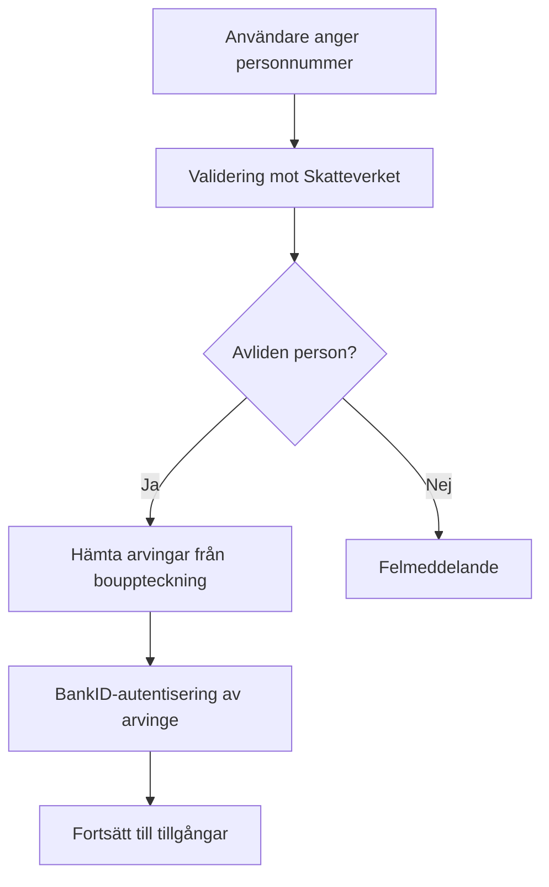
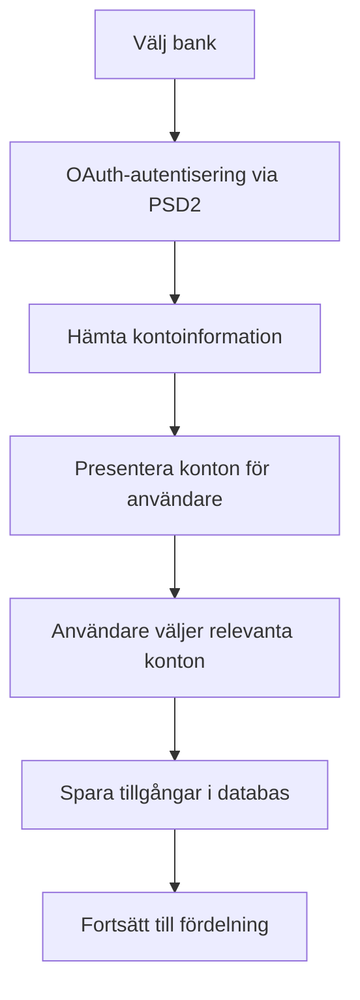
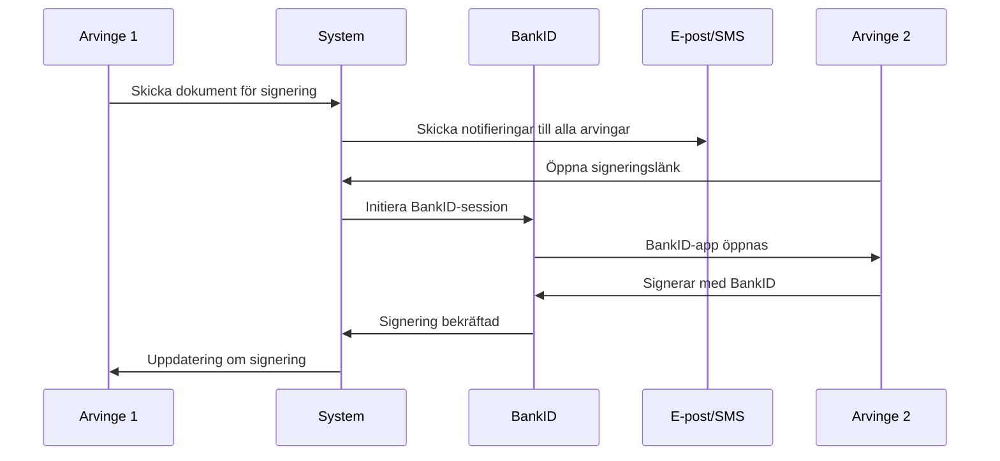

# Digital Arvsskifte - Komplett Integrationslösning för Digitala Arvsskiften

En fullständig digital lösning för hantering av arvsskiften med djupgående integrationer till Skatteverkets API, BankID för säker autentisering och signering, samt PSD2/Open Banking för automatisk hantering av tillgångar.

## 🚀 Snabbstart (för SHB-tekniker)

Kom igång på 30 sekunder:

```bash
# Klona och starta med Docker Compose
git clone [repository-url]
cd digital-arvsskifte
docker-compose up -d

# Öppna http://localhost och testa demo-läget
# Använd demo-personnummer: 195001011111
```

**🎯 Demo-läge aktiverat:** Alla banker, BankID och Skatteverket är mockade för enkel demonstration utan riktiga API-nycklar.

## 📋 Översikt

Digital Arvsskifte är en modern webapplikation byggd för att förenkla och digitalisera hela processen för arvsskiften i Sverige. Systemet integrerar med flera myndigheter och finansiella institutioner för att skapa en smidig, säker och effektiv lösning.

### 🎯 Huvudfunktioner

- **🔍 Digital identifiering** av avliden person via Skatteverkets API
- **👥 Automatisk hämtning** av arvingar från bouppteckning
- **🛡️ BankID-autentisering** för säker åtkomst och signering
- **💳 Bankintegration** via PSD2/Open Banking för automatisk tillgångshämtning
- **📋 Testamenthantering** med verifiering och uppladdning
- **⚖️ Fullmaktshantering** för ombud och juridiska representanter
- **📊 Automatisk fördelning** av tillgångar mellan arvingar
- **📄 PDF-generering** för alla dokument och sammanfattningar
- **📧 Notifieringssystem** via e-post och SMS

## 🏗️ Teknisk Arkitektur

### Frontend Stack
- **React 18** med TypeScript för typsäkerhet
- **Vite** för snabb utveckling och byggprocess
- **Tailwind CSS** för responsiv och modern design
- **Radix UI** för tillgängliga UI-komponenter
- **React Router** för navigation
- **React Hook Form** med Zod-validering

### Backend Integrationer
- **Supabase** för databas och autentisering
- **Skatteverkets API** för personnummervalidering och arvingshämtning
- **BankID API** för digital signering
- **PSD2/Open Banking** för bankintegrationer
- **PDF-tjänster** för dokumentgenerering

### Säkerhet & Compliance
- **Row Level Security (RLS)** i databas
- **Krypterade certifikat** för API-kommunikation
- **GDPR-compliance** för personuppgiftshantering
- **BankID-integration** enligt svenska myndighetskrav

## 📁 Projektstruktur

```
src/
├── components/               # React-komponenter
│   ├── ui/                  # Grundläggande UI-komponenter (Radix UI)
│   ├── steps/               # Steg-specifika komponenter
│   ├── AssetPreferences.tsx # Hantering av tillgångspreferenser
│   ├── PhysicalAssets.tsx   # Fysiska tillgångar
│   ├── ProgressIndicator.tsx # Progressindikator
│   └── TestamentUpload.tsx  # Testamentuppladdning
├── services/                # Tjänster för API-integrationer
│   ├── bankidService.ts     # BankID-integration
│   ├── skatteverketService.ts # Skatteverkets API
│   ├── openBankingService.ts # PSD2/Open Banking
│   ├── pdfService.ts        # PDF-generering
│   ├── notificationService.ts # E-post/SMS-notifieringar
│   └── representativeService.ts # Fullmaktshantering
├── hooks/                   # Custom React hooks
│   ├── useTranslation.ts    # Flerspråkighetsstöd
│   └── use-toast.ts         # Toast-notifieringar
├── config/                  # Konfigurationsfiler
│   ├── integrations.ts      # API-konfigurationer
│   ├── integrationConfig.ts # Integrationsinställningar
│   └── integrationSettings.ts # Miljöspecifika inställningar
└── lib/                     # Hjälpfunktioner
    └── utils.ts             # Gemensamma utilities
```

## 🚀 Installation och Setup

### Förutsättningar
- Node.js 18+ eller Bun
- Supabase-konto för databas och autentisering
- API-nycklar från Skatteverket
- BankID-certifikat för produktionsmiljö

### 1. Grundläggande Installation

```bash
# Klona repository
git clone [repository-url]
cd digital-arvsskifte

# Installera dependencies
npm install
# eller
bun install

# Starta utvecklingsserver
npm run dev
# eller
bun dev
```

### 2. Miljökonfiguration

Skapa `.env.local` fil:

```env
# Supabase
VITE_SUPABASE_URL=din_supabase_url
VITE_SUPABASE_ANON_KEY=din_supabase_anon_key

# API-endpoints (miljöspecifika)
VITE_API_BASE_URL=https://din-backend-url.com/api
```

### 3. Supabase Setup

#### Databas Schema
```sql
-- Skapa tabeller för arvsskiften
CREATE TABLE estates (
  id UUID PRIMARY KEY DEFAULT gen_random_uuid(),
  deceased_personal_number TEXT NOT NULL,
  created_at TIMESTAMP WITH TIME ZONE DEFAULT NOW(),
  status TEXT DEFAULT 'draft',
  total_assets DECIMAL(15,2),
  total_debts DECIMAL(15,2)
);

-- Skapa tabeller för arvingar
CREATE TABLE heirs (
  id UUID PRIMARY KEY DEFAULT gen_random_uuid(),
  estate_id UUID REFERENCES estates(id),
  personal_number TEXT NOT NULL,
  name TEXT NOT NULL,
  relationship TEXT,
  inheritance_percentage DECIMAL(5,2),
  signed_at TIMESTAMP WITH TIME ZONE,
  created_at TIMESTAMP WITH TIME ZONE DEFAULT NOW()
);

-- Skapa tabeller för tillgångar
CREATE TABLE assets (
  id UUID PRIMARY KEY DEFAULT gen_random_uuid(),
  estate_id UUID REFERENCES estates(id),
  bank TEXT NOT NULL,
  account_type TEXT,
  account_number TEXT,
  amount DECIMAL(15,2),
  is_debt BOOLEAN DEFAULT FALSE,
  should_remain BOOLEAN DEFAULT FALSE,
  created_at TIMESTAMP WITH TIME ZONE DEFAULT NOW()
);

-- Aktivera Row Level Security
ALTER TABLE estates ENABLE ROW LEVEL SECURITY;
ALTER TABLE heirs ENABLE ROW LEVEL SECURITY;
ALTER TABLE assets ENABLE ROW LEVEL SECURITY;

-- Skapa policies för säker åtkomst
CREATE POLICY "Users can view their own estates" ON estates
  FOR SELECT USING (auth.uid()::text IN (
    SELECT h.personal_number FROM heirs h WHERE h.estate_id = id
  ));
```

## 🔧 Produktionskonfiguration

### Skatteverkets API Integration

```typescript
// src/config/integrations.ts
export const integrationConfig = {
  skatteverket: {
    enabled: true,
    environment: 'production', // eller 'test'
    apiBaseUrl: 'https://api.skatteverket.se/prod',
    apiKey: process.env.SKATTEVERKET_API_KEY,
    certificatePath: '/secure/certificates/skatteverket.p12',
    certificatePassword: process.env.SKATTEVERKET_CERT_PASSWORD,
    
    // API-endpoints
    endpoints: {
      validatePersonalNumber: '/person/validate',
      fetchHeirs: '/inheritance/heirs',
      fetchEstateInfo: '/inheritance/estate'
    },
    
    // Timeout och retry-inställningar
    timeout: 30000,
    retryAttempts: 3,
    retryDelay: 1000
  }
}
```

### BankID Integration

```typescript
// src/config/integrations.ts
export const integrationConfig = {
  bankid: {
    enabled: true,
    environment: 'production', // 'test' för utveckling
    apiBaseUrl: 'https://appapi2.bankid.com/rp/v6.0',
    
    // Certifikat för produktion
    certificatePath: '/secure/certificates/bankid-prod.p12',
    certificatePassword: process.env.BANKID_CERT_PASSWORD,
    
    // Test-certifikat för utveckling
    testCertificatePath: '/secure/certificates/bankid-test.p12',
    testCertificatePassword: process.env.BANKID_TEST_CERT_PASSWORD,
    
    // API-endpoints
    endpoints: {
      authenticate: '/auth',
      sign: '/sign',
      collect: '/collect',
      cancel: '/cancel'
    },
    
    // Timeout-inställningar
    authTimeout: 30000,
    signTimeout: 180000,
    pollInterval: 2000
  }
}
```

### PSD2/Open Banking Integration

```typescript
// src/config/integrations.ts
export const integrationConfig = {
  openBanking: {
    enabled: true,
    providers: {
      swedbank: {
        clientId: process.env.SWEDBANK_CLIENT_ID,
        clientSecret: process.env.SWEDBANK_CLIENT_SECRET,
        redirectUri: 'https://din-app.com/callback/swedbank',
        scopes: ['account-info', 'payment-info'],
        apiBaseUrl: 'https://psd2.swedbank.se/psd2'
      },
      handelsbanken: {
        clientId: process.env.HANDELSBANKEN_CLIENT_ID,
        clientSecret: process.env.HANDELSBANKEN_CLIENT_SECRET,
        redirectUri: 'https://din-app.com/callback/handelsbanken',
        scopes: ['account-info', 'payment-info'],
        apiBaseUrl: 'https://api.handelsbanken.se/openbanking'
      },
      seb: {
        clientId: process.env.SEB_CLIENT_ID,
        clientSecret: process.env.SEB_CLIENT_SECRET,
        redirectUri: 'https://din-app.com/callback/seb',
        scopes: ['account-info', 'payment-info'],
        apiBaseUrl: 'https://api.seb.se/ais/v1'
      }
    },
    
    // Gemensamma inställningar
    consentValidity: 90, // dagar
    maxAccountHistory: 365, // dagar
    enableCaching: true,
    cacheTimeout: 300000 // 5 minuter
  }
}
```

## 📊 Dataflöde och Processhantering

### 1. Identifieringsprocess



### 2. Tillgångshantering



### 3. Signeringsprocess



## 📱 Användarflöde

### Steg 1: Identifiering och Autentisering
1. **Personnummerinmatning** - Användare anger avlidens personnummer
2. **Skatteverket-validering** - System verifierar mot Skatteverkets register
3. **Arvingshämtning** - Automatisk hämtning av arvingar från bouppteckning
4. **BankID-autentisering** - Arvinge autentiserar sig med BankID
5. **Fullmaktshantering** - Möjlighet att utse ombud eller juridisk representant

### Steg 2: Tillgångar och Skulder
1. **Bankval** - Välj banker för automatisk hämtning
2. **PSD2-autentisering** - OAuth-flöde för varje bank
3. **Kontohämtning** - Automatisk import av konton och saldon
4. **Manuell inmatning** - Komplettera med manuella tillgångar
5. **Skuldhantering** - Registrering av lån och skulder
6. **Kvarvarande poster** - Markera vad som ska vara kvar (t.ex. bolån)

### Steg 3: Fördelning och Testament
1. **Testamentverifiering** - Uppladdning och verifiering av testament
2. **Arvingaregistrerng** - Lägg till eller redigera arvingar
3. **Procentuell fördelning** - Fördela tillgångar procentuellt
4. **Specifik tilldelning** - Tilldela specifika konton till arvingar
5. **Fysiska tillgångar** - Hantering av fastigheter, bilar, etc.
6. **Tillgångspreferenser** - Välja mellan överföring eller försäljning

### Steg 4: Kontaktuppgifter och Kommunikation
1. **Kontaktinsamling** - Samla e-post och telefonnummer
2. **Notifieringsinställningar** - Välj kommunikationskanal (e-post/SMS)
3. **Dokumentutskick** - Skicka arvsskiftesdokument till alla parter
4. **Spårning** - Följa upp vem som fått och läst dokumenten

### Steg 5: Digital Signering
1. **BankID-signering** - Alla arvingar signerar med BankID
2. **Statusövervakning** - Realtidsuppdateringar av signeringsstatus
3. **Påminnelser** - Automatiska påminnelser till osignerade
4. **Verifiering** - Bekräftelse när alla har signerat

### Steg 6: Genomförande och Avslut
1. **Bankutskick** - Automatisk överföring av instruktioner till banker
2. **PSD2-genomförande** - Verkställande av överföringar via Open Banking
3. **PDF-generering** - Slutlig sammanfattning och dokumentation
4. **Arkivering** - Säker lagring av alla dokument
5. **Slutrapport** - Bekräftelse på genomfört arvsskifte

## 🔒 Säkerhet och Compliance

### Dataskydd (GDPR)
- **Minimering** - Samla endast nödvändig information
- **Kryptering** - All känslig data krypteras i transit och vila
- **Åtkomstloggning** - Fullständig loggning av dataåtkomst
- **Raderingsrätt** - Automatisk radering efter avslutade ärenden
- **Samtycke** - Tydligt samtycke för databehandling

### BankID-säkerhet
- **Certifikathantering** - Säker hantering av BankID-certifikat
- **Session-hantering** - Korrekt hantering av BankID-sessioner
- **Timeout-hantering** - Automatisk timeout vid inaktivitet
- **Felhantering** - Robust felhantering för BankID-fel

### API-säkerhet
- **TLS 1.3** - All kommunikation över säkra kanaler
- **OAuth 2.0** - Säker autentisering för banktjänster
- **Rate limiting** - Skydd mot överbelastning
- **API-nycklar** - Säker hantering av API-nycklar och hemligheter

### Databassäkerhet
- **Row Level Security** - Granulär åtkomstkontroll
- **Kryptering** - Databaskryptering i vila
- **Backup** - Krypterade och säkra backuper
- **Audit logging** - Fullständig auditloggning

## 📈 Skalbarhet och Prestanda

### Frontend-optimering
- **Code splitting** - Lazy loading av komponenter
- **Caching** - Intelligent caching av API-svar
- **Progressive loading** - Stegvis laddning av data
- **Error boundaries** - Robust felhantering

### Backend-optimering
- **Connection pooling** - Effektiv databashantering
- **API caching** - Redis för API-cache
- **CDN** - Snabb leverans av statiska resurser
- **Load balancing** - Fördelning av trafik

### Övervakningsstrategier
- **Performance monitoring** - Övervakning av applikationsprestanda
- **Error tracking** - Automatisk felrapportering
- **Uptime monitoring** - Övervakning av tjänstetillgänglighet
- **User analytics** - Användarbeteendeanalys

## 🧪 Testning och Kvalitetssäkring

### Teststrategier
```bash
# Enhetstester
npm run test:unit

# Integrationstester
npm run test:integration

# End-to-end-tester
npm run test:e2e

# Säkerhetstester
npm run test:security

# Prestandardtester
npm run test:performance
```

### Testmiljöer
- **Utveckling** - Lokala mocks och simulatorer
- **Test** - Skatteverkets och BankID:s testmiljöer
- **Staging** - Produktionslik miljö med testdata
- **Produktion** - Live-miljö med riktiga integrationer

## 🔧 Utveckling och Anpassning

### Lägg till ny bank för PSD2
```typescript
// src/services/openBankingService.ts
export const bankProviders = {
  nordea: {
    name: 'Nordea',
    clientId: process.env.NORDEA_CLIENT_ID,
    authEndpoint: 'https://api.nordea.com/v4/authorize',
    tokenEndpoint: 'https://api.nordea.com/v4/token',
    accountsEndpoint: 'https://api.nordea.com/v4/accounts',
    scopes: ['account:list:iban', 'account:details']
  }
}
```

### Lägg till ny dokumenttyp
```typescript
// src/services/pdfService.ts
export const documentTypes = {
  estate_inventory: {
    template: 'bouppteckning_template.html',
    requiredFields: ['deceased', 'heirs', 'assets'],
    filename: 'bouppteckning_{personalNumber}_{date}.pdf'
  }
}
```

### Anpassa notifieringar
```typescript
// src/services/notificationService.ts
export const notificationTemplates = {
  heir_signing_reminder: {
    email: {
      subject: 'Påminnelse: Signera arvsskifte',
      template: 'reminder_email.html'
    },
    sms: {
      message: 'Påminnelse: Signera arvsskifte via länk: {signUrl}'
    }
  }
}
```

## 📞 Support och Underhåll

### Loggning och Felsökning
```typescript
// Strukturerad loggning
logger.info('Estate process started', {
  personalNumber: '19800101-1234',
  userId: 'uuid',
  step: 'identification'
});

logger.error('BankID authentication failed', {
  error: error.message,
  orderRef: 'bankid-ref',
  personalNumber: '19800101-1234'
});
```

### Vanliga Problem och Lösningar

**Problem: BankID-timeout**
```typescript
// Lösning: Öka timeout och lägg till retry-logik
const config = {
  timeout: 60000, // 60 sekunder
  retryAttempts: 3,
  retryDelay: 2000
};
```

**Problem: PSD2-consent upphör**
```typescript
// Lösning: Automatisk förnyelse av consent
if (isConsentExpired(consent)) {
  const newConsent = await renewConsent(bankProvider);
  await updateStoredConsent(newConsent);
}
```

### Underhållsrutiner
- **Daglig backup** - Automatisk backup av databas
- **Veckovis säkerhetsuppdatering** - Säkerhetspatchar
- **Månadsvis prestandardgranskning** - Optimering av prestanda
- **Kvartalsvis säkerhetsgenomgång** - Säkerhetsrevision

## 📋 Roadmap och Utveckling

### Kommande funktioner
- **Blockchain-verifiering** - Oföränderlig dokumentation
- **AI-assisterad fördelning** - Intelligent fördelningsförslag
- **Mobilapp** - Native mobilapplikation
- **Internationellt stöd** - Stöd för andra länders system
- **API för tredjepartslösningar** - Öppet API för integration

### Tekniska förbättringar
- **Mikrotjänstarkitektur** - Uppdelning i mindre tjänster
- **GraphQL API** - Effektivare API-kommunikation
- **WebSocket** - Realtidsuppdateringar
- **PWA** - Progressive Web App-funktionalitet

## 🤝 Bidrag och Community

### Utvecklingsbidrag
1. Forka repository
2. Skapa feature branch (`git checkout -b feature/amazing-feature`)
3. Commita ändringar (`git commit -m 'Add amazing feature'`)
4. Pusha till branch (`git push origin feature/amazing-feature`)
5. Öppna Pull Request

### Kodstandarder
- **ESLint** - Följ projektets linting-regler
- **Prettier** - Konsekvent kodformatering
- **TypeScript** - Stark typning för alla komponenter
- **Testning** - Minst 80% kodtäckning

## 📄 Licens och Legal

Detta projekt är licensierat under MIT-licensen - se [LICENSE](LICENSE) filen för detaljer.

### Disclaimer
Detta är en demonstrationslösning. För produktionsanvändning krävs:
- Giltiga avtal med Skatteverket för API-åtkomst
- Certifierade BankID-integrationer
- PSD2-licenser från relevanta banker
- Fullständig säkerhetsrevision och compliance-verifiering

### Kontakt
- **Utvecklingsteam**: dev@digital-arvsskifte.se
- **Support**: support@digital-arvsskifte.se
- **Säkerhet**: security@digital-arvsskifte.se

---

**Digital Arvsskifte** - Moderniserar Sveriges arvsskiften med digital teknik och säkra integrationer.